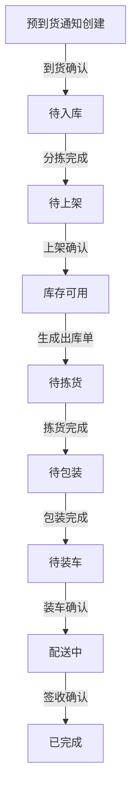

# 项目子模块说明

本项目包含多个子模块，每个子模块代表一个独立的功能区域。以下是对各子模块的详细介绍：

## 基础信息模块

### 1. `/company`
**公司管理**
- 提供公司信息的增删改查功能。

### 2. `/department`
**部门管理**
- 负责部门信息的维护与管理。

### 3. `/staff`
**员工管理**
- 提供员工信息的管理接口，包括添加、编辑、删除和查询员工信息。

### 4. `/warehouse`
**仓库管理**
- 涉及仓库的基本信息和状态维护。

### 5. `/location`
**库位管理**
- 提供库位信息的管理和维护。

## 供应链模块

### 6. `/supplier`
**供应商管理**
- 提供供应商的基本信息维护接口，包括供应商的联系方式、地址及相关资质信息管理。

### 7. `/recipient`
**收货方管理**
- 管理收货方的详细信息，包括收货方名称、地址、联系人及联系方式。

### 8. `/carrier`
**承运商管理**
- 提供承运商信息的管理功能，包括承运商资质、服务范围及评价记录。

## 商品与库存模块

### 9. `/goods`
**商品管理**
- 涉及商品的基本信息管理，包括商品编码、名称、规格、单位及其他属性。
- 暂不支持商品分类管理。

### 10. `/inventory`
**库存管理**
- 提供库存查询、修改和统计功能，包括实时库存查询、批次管理、库存预警和历史记录追踪。

## 入库模块

### 11. `/asn`
**预到货通知（ASN）**
- 管理预到货通知单，支持创建、更新和删除预到货通知。
- 提供到货确认和入库对接接口。

### 12. `/sorting`
**分拣管理**
- 涉及商品分拣的功能模块，包括自动分拣和手动分拣流程的管理。

### 13. `/putaway`
**上架管理**
- 提供商品上架的流程和记录管理，包括库位分配及上架确认。

## 出库模块

### 14. `/removal`
**下架管理**
- 管理商品下架的流程和操作，包括库存扣减及库位释放。

### 15. `/dn`
**出库单管理**
- 涉及出库单的生成、编辑和状态跟踪，支持与配送模块的联动。

### 16. `/picking`
**拣货管理**
- 提供拣货计划的生成和拣货操作的接口，支持多种拣货策略（如先进先出、按批次拣货等）。

### 17. `/packing`
**包装管理**
- 管理商品包装的相关流程，包括包装材料选择、打包记录及标签打印。

### 18. `/loading`
**装车管理**
- 涉及商品的装车流程和记录，包括车次管理、装车核对及异常处理。

### 19. `/delivery`
**配送管理**
- 提供商品配送的操作和状态查询，包括配送单生成、物流跟踪及签收确认。

## 盘点与调整模块

### 20. `/cyclecount`
**循环盘点**
- 提供周期性库存盘点的接口，包括盘点任务生成、结果核对及差异处理。

### 21. `/adjustment`
**库存调整**
- 管理库存调整的操作和记录，包括库存增加、减少及批次调整。

## 调拨与结算模块

### 22. `/transfer`
**库存调拨**
- 提供库存调拨操作的接口，包括调拨单生成、审批及执行。

### 23. `/payment`
**付款管理**
- 涉及付款记录和结算的管理，包括账单生成、支付确认及对账。

### 24. `/return`
**退货管理**
- 提供退货流程和记录的接口，包括退货申请、审核及执行。

---

## 收货与发货流程图

以下是收货和发货状态及流程的转换图示：

## 使用说明

1. 各子模块的具体接口详情，请参考 Swagger API 文档。
2. 按需调用子模块的接口以实现对应的功能需求。

## 联系方式
如有任何疑问或建议，请联系项目负责人。
